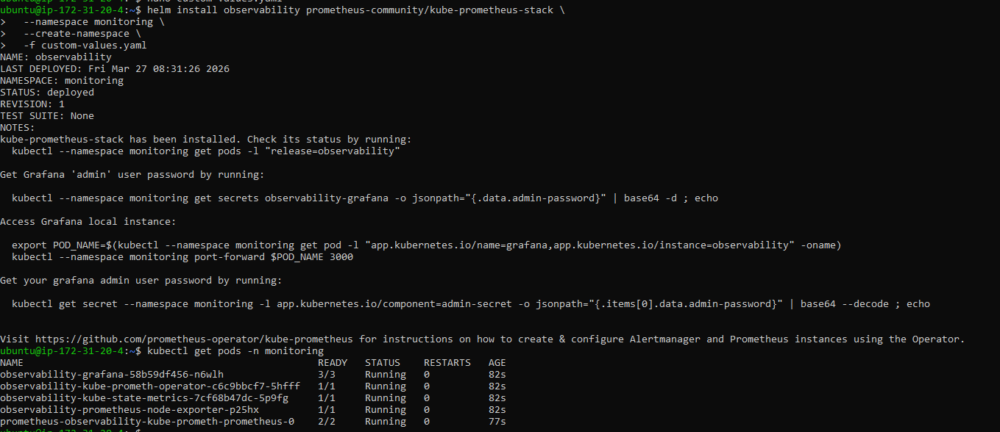

#  Kubernetes Observability Stack (K3s + Prometheus + Grafana)

A production-grade Kubernetes monitoring solution. 

##  Architecture
* **Kubernetes Distribution:** K3s (Single-node)
* **Package Manager:** Helm 3
* **Monitoring Stack:** Prometheus, Grafana, kube-state-metrics, node-exporter
* **Alerting:** Alertmanager (Slack Integration)
* **Target Environment:** AWS EC2 (`t3.medium` / 4GB RAM)

##  Prerequisites
* An AWS EC2 instance with at least 4GB of RAM running Ubuntu or Amazon Linux.
* SSH access to the instance.
* **Port 8080** opened in your AWS Security Group to access the Grafana UI.
* A free Slack Incoming Webhook URL (for Alertmanager).

---

##  Deployment Guide

### Phase 1: Cluster Setup (K3s & Helm)
Install a lightweight Kubernetes cluster and the Helm package manager.

1. **Install K3s:**
   ```bash
   curl -sfL [https://get.k3s.io](https://get.k3s.io) | sh -


 2. **Configure Kubeconfig:**


```bash
mkdir -p ~/.kube
sudo cp /etc/rancher/k3s/k3s.yaml ~/.kube/config
sudo chown $(id -u):$(id -g) ~/.kube/config
Install Helm:

```bash
curl [https://raw.githubusercontent.com/helm/helm/main/scripts/get-helm-3](https://raw.githubusercontent.com/helm/helm/main/scripts/get-helm-3) | bash


Configure Alertmanager (Slack Setup)
Before deploying the stack, we need to generate a webhook URL so Alertmanager can send critical alerts directly to your team's Slack channel.

Go to api.slack.com/apps and click Create New App (From scratch).

Name the app (e.g., "K8s Alerts") and select your workspace.

Under "Features" on the left menu, click Incoming Webhooks and toggle it to On.

Click Add New Webhook to Workspace, pick the channel where you want alerts to go (e.g., #monitoring), and click Allow.

Copy the Webhook URL provided (it starts with https://hooks.slack.com/...).


Phase 2: Deploy the Observability Stack
We apply strict memory limits to prevent the stack from crashing the 4GB instance, while embedding the Slack webhook for Alertmanager.

 
1. **Add the Helm Repository:**

```bash
helm repo add prometheus-community [https://prometheus-community.github.io/helm-charts](https://prometheus-community.github.io/helm-charts)
helm repo update

2. **Create the custom-values.yaml file:**
Note: Replace YOUR_SLACK_WEBHOOK_URL with your actual Slack URL before deploying.

```YAML
alertmanager:
  enabled: true
  config:
    route:
      receiver: 'slack-notifications'
      group_by: ['alertname', 'namespace']
    receivers:
    - name: 'slack-notifications'
      slack_configs:
      - api_url: 'YOUR_SLACK_WEBHOOK_URL'
        send_resolved: true
        title: 'K8s Alert: {{ .Status | toUpper }}'
        text: '{{ range .Alerts }}{{ .Annotations.summary }}\n{{ end }}'
prometheus:
  prometheusSpec:
    retention: 2d
    resources:
      requests:
        memory: 512Mi
      limits:
        memory: 1Gi
grafana:
  resources:
    requests:
      memory: 128Mi
    limits:
      memory: 256Mi

3. **Deploy via Helm:**

```bash
helm install observability prometheus-community/kube-prometheus-stack \
  --namespace monitoring \
  --create-namespace \
  -f custom-values.yaml




### Phase 3: Access & Visualize (Grafana)

Port-Forward the UI:

```bash
kubectl port-forward svc/observability-grafana 8080:80 -n monitoring --address 0.0.0.0
Log In: Navigate to http://<YOUR_EC2_PUBLIC_IP>:8080 (Default credentials: admin / prom-operator).


Import Dashboard: Import Dashboard ID 15661 for a comprehensive Kubernetes cluster overview. Select observability-prometheus as the data source.


To verify metrics are flowing, deploy a dummy application and scale it up to trigger resource usage:

```bash
kubectl create namespace demo-app
kubectl create deployment nginx-dummy --image=nginx -n demo-app
kubectl scale deployment nginx-dummy --replicas=5 -n demo-app


